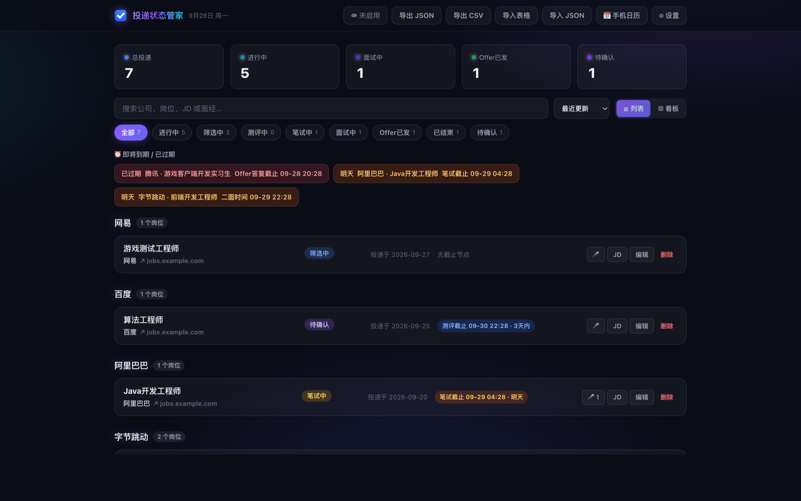
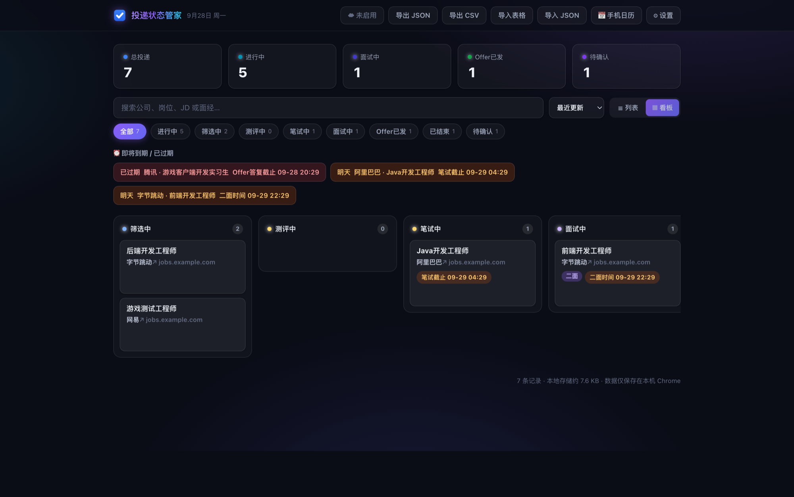

# 投递状态管家

**在岗位详情页点一下，把这条投递存下来；之后在一个面板里跟进到 Offer。**

秋招投出去的岗位散在招聘网站后台、收藏夹和聊天记录里：投过哪些、投到哪一步、下一个截止是什么时候、
上一轮面试被问了什么 —— 这些本该一眼看到。这个 Chrome 扩展把整条链路收进一个面板：
一键导入 → 状态跟踪 → 截止提醒 → 面经复盘 → 多设备同步。数据默认只存在本机。

当前版本 **v1.18.2**。



## 目录

- [能做什么](#能做什么)
- [安装](#安装)
- [开始使用](#开始使用)
- [可选服务端：云同步 / AI 识别 / 推送](#可选服务端云同步--ai-识别--推送)
- [数据与隐私](#数据与隐私)
- [已知限制](#已知限制)
- [它是怎么做的](#它是怎么做的)
- [反馈](#反馈)

## 能做什么

**一键导入** —— 在岗位详情页点扩展图标，公司、岗位、投递链接、JD 正文自动填好，核对一下就能保存。
「识别来源」会写明每个字段是从页面哪里认出来的，认错了当场改；抓不到内容的页面（登录墙、懒加载）
会给出填引导，填完一样能存。

**AI 兜底识别（可选）** —— 规则没抓到、或只抓到半截岗位名时，把页面上更完整的岗位名挑出来自动填上。
旁边留一个「撤销」，你正在编辑的字段它一律不碰。开启只需服务端地址与注册口令，**不必填同步口令、
也不必启用云同步**。

**状态与看板** —— 投递中 / 笔试 / 测评 / 面试中 / Offer / 已结束；每条记录的进度、面试轮次与时间线
一目了然，支持搜索、筛选与看板视图。



**截止节点** —— 笔试、测评、面试、Offer 答复都记成节点，已过期与 24 小时内到期的置顶提醒；
可导出 `.ics` 导入手机系统日历，或交给服务端推送。

**面经 / 复盘** —— 每完成一轮笔试或面试，在卡片上点「🎤」按轮次记下被问到的题目与复盘；
长文在全宽弹窗里阅读，正文参与搜索。

**表格导入** —— 已经在飞书 / 腾讯文档 / WPS / Excel 里记着投递表的，把表头一起选中复制 → 回到面板粘贴
→ 先出预览（认出了哪几列、哪几格没认出来都可以手动指定）→ 确认导入。规则是**以表格为准**：
表里写了的值覆盖本机，表里空着的保留本机原值；不满意可以整份撤销这次导入。也支持拖入 `.csv` / `.tsv`。

**备份** —— 「导出 JSON」是完整备份（换电脑靠它），「导入 JSON」是**合并**不是覆盖，两台机器的记录会并在一起；
每次启动 Chrome 还会自动往「下载 / 投递备份 /」写一份。

**手机端（可选）** —— 配套的手机页用来随时查看进度与面经，添加到主屏幕就能像 App 一样打开。

## 安装

1. 下载本仓库（`Code → Download ZIP`，或 `git clone`），解压到一个**不会被清理、之后也不会移动**的位置
2. Chrome 打开 `chrome://extensions`（Edge 是 `edge://extensions`）
3. 打开右上角「开发者模式」→ 点「加载已解压的扩展程序」→ 选择含 `manifest.json` 的那一层目录
4. 点浏览器工具栏的拼图图标，把「投递状态管家」固定到工具栏

升级：用新版本覆盖同一目录 → 在扩展页对本扩展点「重新加载」。**数据不会丢。**

> 为什么是「加载已解压」：本扩展未上架应用商店，所以走本地加载的方式安装，功能与商店版本一致。

## 开始使用

1. 打开任意岗位详情页，点扩展图标
2. 核对公司 / 岗位 / 投递链接 / JD → 点「保存投递」
3. 点「打开面板」查看全部投递；每天开工先看一眼顶部的「即将到期 / 已过期」
4. 每面完一轮，在卡片上点「🎤」记一条面经；想改状态、记备注、写截止时间，在卡片上直接改

## 可选服务端：云同步 / AI 识别 / 推送

这三项依赖一个配套服务端（**不在本仓库内**，由提供者部署）。只用本机功能的话，这一整节都可以跳过 ——
扩展装完就能用。

| 能力 | 怎么开 | 说明 |
|---|---|---|
| 云同步 | 设置 → ☁ 云同步 → 填**服务端地址 + 同步口令** → 勾选「启用云同步」 | 多台设备填同一串口令即可自动合并；手机页也靠它 |
| AI 兜底识别 | 设置 → 填**服务端地址 + 注册口令** | **不需要同步口令、不需要启用云同步**；识别与同步是两件事 |
| 手机提醒 | 设置 → 📱 手机提醒 → 选 PushPlus（普通微信）/ Bark（iPhone）/ 通用 Webhook（飞书、钉钉、企业微信） | 不想用推送也可以直接导出 `.ics` 导进手机系统日历 |

同步的合并是按**条目**做的：每条记录各带自己的时间戳，删除用只增不删的墓碑表达 —— 两端各自新增的内容
会并集保留、任一端的删除也会同步过去，不会静默丢数据。

口令即身份，由服务端管理员发放；**不要转发给他人**。

## 数据与隐私

- 记录默认**只存在本机浏览器**（`chrome.storage.local`）。在 `chrome://extensions` 里「移除」扩展会一并
  删除数据，建议用面板「导出 JSON」定期备份
- 启用云同步后，记录（含 JD 全文）会存到**提供者部署的服务端**，仅凭口令访问；不收集邮箱、手机号等
  任何账号信息，没有第三方统计与埋点
- 开启 AI 识别后，点开扩展时会把这**一页的地址、网页标题、页面上抓到的候选文本**经服务端转交模型识别
  一次；**不含整页 HTML，也不含 JD 全文、备注或其他记录**。识别结果只缓存在本机（60 天、最多 300 页），
  不上传、不与他人共用
- 扩展本身**不含任何密钥**：模型的 key 只存在于服务端的环境变量里
- 记录里的面经**不进推送正文、不进提醒队列、不进日历订阅**

## 已知限制

- 需要 Chrome / Edge 等 **Chromium 桌面浏览器**（要能用「开发者模式」）；手机端是配套网页，不是手机浏览器扩展
- 抓取依赖页面结构，招聘网站改版后可能抓不到 —— 此时会提示手动填写，不影响保存
- 「识别拿不到建议」不会弹错误提示（安静降级为本地规则的结果），这是刻意的：识别是增强，不是必经环节
- 表格导入**不解析面经列**（一条记录可能有多条面经，表格表达不了），面经请用 JSON 做完整备份
- 两端各自新建「同一条」面经会变成两条 —— 宁可留重复，不静默丢内容；手动删一条即可，删除会同步到另一端
- 面经是长文本，条数很多时自动备份会跳过，建议手动导出 JSON

## 它是怎么做的

- **Manifest V3 扩展，零依赖、无构建步骤**：全部是原生 ES 模块，浏览器直接跑源码 ——
  克隆下来就能「加载已解压的扩展程序」，没有打包产物、没有第三方 SDK
- 扩展只发**跨域简单请求**（`Content-Type: text/plain`，不带自定义请求头），凭证放在请求体里 ——
  不触发预检，服务端按常规返回 CORS 头即可
- 识别结果的判据（答案必须是这一页上真实出现过的字）**只有一份实现**，在客户端；服务端只负责问模型

```
manifest.json          扩展清单（MV3）
shared.js              数据模型、本机存储、迁移与合并内核
sync.js                云同步：协议、水位、推送 / 拉取
transfer.js            导入导出：JSON 备份、CSV、表格解析
ai.js                  AI 识别的本机缓存与接地判据
background.js          后台：提醒、自动备份
content/extract.js     岗位页内容抓取
popup/                 点开扩展后的导入表单
dashboard/             主面板：列表 / 看板 / 面经 / 设置
icons/                 图标
```

## 反馈

用起来遇到问题、或希望适配某个招聘网站，欢迎开 Issue 说明「哪个网站 + 哪个页面」。
